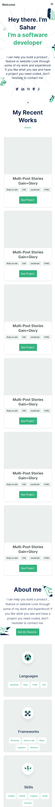

# Portfolio-setup-and-mobile-version-skeleton

> This is the first milestone in the process of creating my portfolio website.

This website is a setup and mobile version skeleton of my portfolio.

## Built With

- HTML
- CSS
- VSCode

## Authors

👤 **Sahar Abdel Samad**

- GitHub: [@sahar-abdelsamad](https://github.com/Sahar-AbdelSamad)
- Twitter: [@abdelsamadsahar](https://twitter.com/home)
- LinkedIn: [abdel-samad-sahar](https://www.linkedin.com/in/abdel-samad-sahar-353977223/)

## 🤝 Contributing

Contributions, issues, and feature requests are welcome!

Feel free to check the [issues page](../../issues/).

## Show your support

Give a ⭐️ if you like this project!

## 📝 License

This project is [MIT](LICENSE) licensed.
